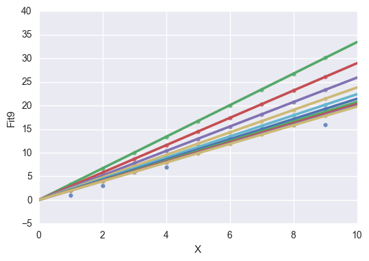
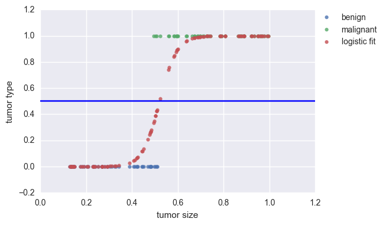
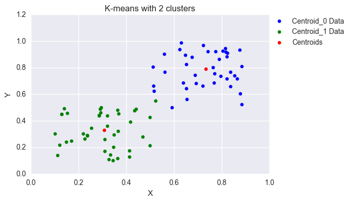

# Machine Learning Tutorials
This repository contains some tutorials on basic machine learning techniques. So far, it contains:

1) Tutorial on linear regression and gradient descent, showing how a computer can use supervised learning to find the best fit for a line.

2) Tutorial on logistic regession and gradient descent, showing how a computer can use supervised learning to classify data

3) Tutorial on K-means algorithm, showing how a computer can use unsupervised learning to group data.

